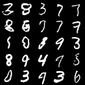

# Deep Convolutional GAN for the MNIST Dataset

This repository shows the results of a simple DCGAN for the MNIST dataset. The training can be started via the train_dcgan.py file.

Generated images from DCGAN:

Generated images from DCGAN during training:

 

 

