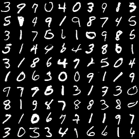
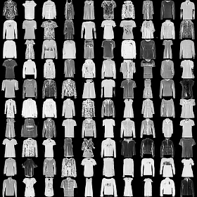
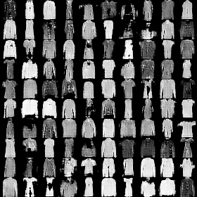
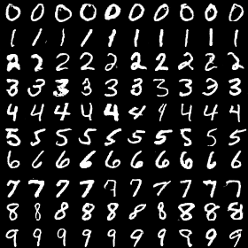
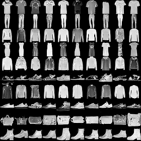
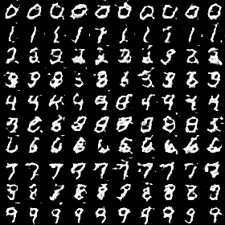
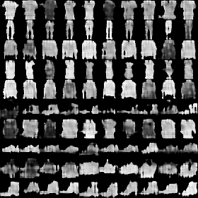

# Deep Convolutional GAN for the MNIST Datasets

This repository implements a simple DCGAN for the MNIST and Fashion-MNIST dataset. The training can be started via the [train_dcgan.py](train_dcgan.py) file. An interactive output of the training script is shown in [train_dcgan.ipynb](train_dcgan.ipynb).

Generated images from DCGAN:





Generated images from DCGAN during training epochs:

 

As you can see in the images above, the generator does not generate all classes in the dataset equally. For example in the generated images of the fashion mnist dataset you can see, that no shoes are generated. This is a known issue when training GANs. To force the generator to generate all classes of a dataset it is possible to train the GAN with class conditions. The results of this Conditional DCGAN are shown below. 

Generated images from Conditional DCGAN:





Generated images from Conditional DCGAN during training epochs:





During or after training it is possible to supervise the training and the stability of the GAN in TensorBoard. TensorBoard should be already installed on your machine, if you installed tensorflow via pip/conda etc. To start TensorBoard type this command from in your terminal after you changed the working directory to the folder, where the training-logs are located:
```
tensorboard --logdir logs
```
When this command is executed successfully, you can run TensorBoard from your Browser. (typically at [http://localhost:6006/](http://localhost:6006/)) 

Supervise training-losses:


Supervise generated images for each epoch:


In addition to the log-files for TensorBoard a **png-file** of the generated images in the final epoch and an animated **gif-file** of the generated images in each epoch is saved in the image folder of the log-directory after the completion of the final epoch. 


 

